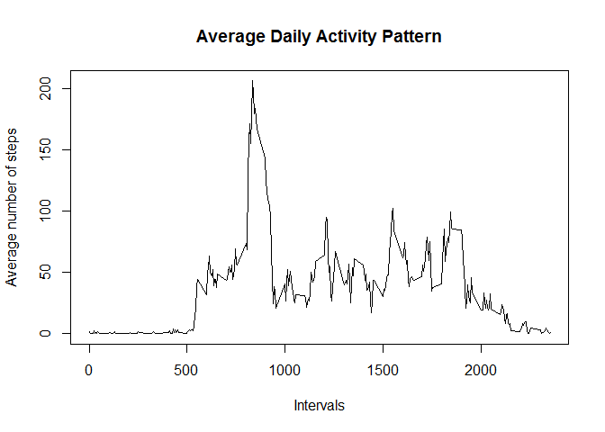
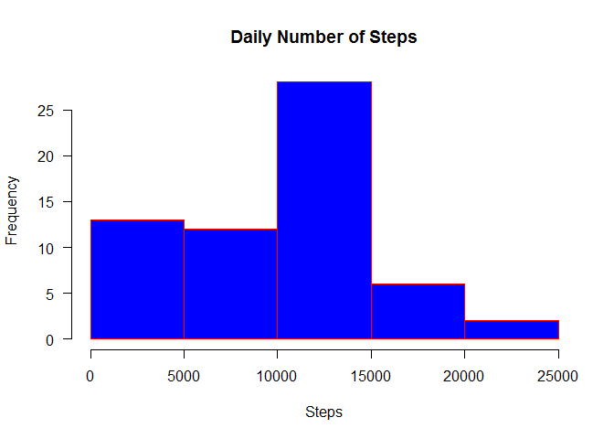
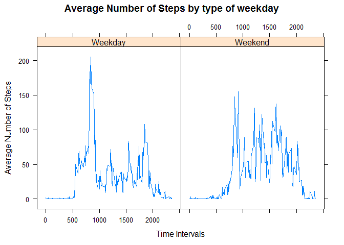

# Reproducible Research: Peer Assessment 1
# Analysis of daly activity
Physical activity is one of the most crucial aspects of a health lifestyle. Individuals engaged in enough exercise and activity are more likely to enjoy a life free of chronic conditions like diabetes.

## Loading and preprocessing the data

```r
suppressPackageStartupMessages(library(data.table))
suppressPackageStartupMessages(library(tidyr))
suppressPackageStartupMessages(library(dplyr))
suppressPackageStartupMessages(library(ggplot2))
suppressPackageStartupMessages(library(anytime))
suppressPackageStartupMessages(library(lattice))

### Data Transformations

# create a temporary directory to store the downloaded file
temp <- tempfile()

# Downloading the file containing the required data
download.file("https://d396qusza40orc.cloudfront.net/repdata%2Fdata%2Factivity.zip", temp)

# Unzipping the downloaded file
con <- unz(temp, "activity.csv")

# Extracting the csv from the unzipped file
data <- read.table(con, header=T, sep = ",")
unlink(temp)
```


## What is mean total number of steps taken per day?

```r
# We need to omitt rows with na in "data"
df <- data %>% drop_na()
head(df)
```

```
##     steps       date interval
## 289     0 2012-10-02        0
## 290     0 2012-10-02        5
## 291     0 2012-10-02       10
## 292     0 2012-10-02       15
## 293     0 2012-10-02       20
## 294     0 2012-10-02       25
```

```r
#### What is mean total number of steps taken per day?
# 1. Total number of steps
Total <- df %>% 
    summarise(Tot_steps = sum(steps))
#mean_steps <- df %>% summarise(Tot_steps = round(sum(steps)/n(),1))
medmean <- df %>% 
  summarise(Aver = round(mean(steps)), Med = median(steps))
```

1. The total number of steps is 570608.
2. The mean number of steps is 37 and the median number of steps is 0.


## What is the average daily activity pattern?

```r
# 3. mean and median of total number of steps
average <- mean(Total$Tot_steps) 
med <- median(Total$Tot_steps)    

int_steps <- df %>% 
                group_by(interval) %>% 
                        summarise(average = mean(steps)) 

# A  Series plot of average number of steps by intervals 
plot(int_steps$interval, int_steps$average, type ="l",
     main = "Average Daily Activity Pattern", 
     xlab = "Intervals", ylab = "Average number of steps")
```

<!-- -->

```r
# Which 5-minute interval, on average across all the days in the dataset, 
#  contains the maximum number of steps?
max_steps <- int_steps %>% 
                        filter(average == max(average)) %>% 
                                       select(interval, average)
```

The daily activity pattern is almost normal with a median of 5.70608\times 10^{5} and a mean of 5.70608\times 10^{5}. The pattern has a maximum number of steps being 206 at the interval 835

## Imputing missing values

```r
# Imputing missing values
## 1. Calculate and report the total number of missing values in 
##### the dataset (i.e. the total number of rows with NAs)
x_na <- sum(is.na(data$steps))

## 2-3. Filling in missing values with medians and creating a new dataset

df2 <- data 

# Devise a strategy for filling in all of the missing values in the datase.
# In place of NA, using the mean for that 5-minute interval
df2$steps[is.na(df2$steps)] <- with(df2, ave(steps, interval, 
                                          FUN = function(x) median(x, na.rm = TRUE)))[is.na(df2$steps)]
## Histogram
Tot_steps_miss <- df2 %>%
              group_by(date) %>%
                        summarise(Tot = sum(steps))
hist(Tot_steps_miss$Tot, main = "Daily Number of Steps",
     xlab="Steps", 
     border="red", 
     col="blue",
     las=1)
```

<!-- -->

The data has 2304 rows with missing data.

## Are there differences in activity patterns between weekdays and weekends?

```r
## Weekdays and weekends 
df3 <- df2 %>% 
  mutate(day = weekdays(anytime(date)), Week = ifelse(day %in% c("Saturday","Sunday"), "Weekend", "Weekday"))
                 
df3 <- aggregate(df3$steps, by = list(df3$Week, df3$interval), mean, na.rm=TRUE)
names(df3) <- c("Week", "interval", "steps") 

average1 <- mean(df3$steps) 
med1 <- median(df3$steps) 
 

## Creating a panel plot
p <- xyplot(steps ~ interval | factor(Week), data=df3, 
            type = 'l',
            main="Average Number of Steps by type of weekday",
            xlab="Time Intervals",
            ylab="Average Number of Steps", cex.main=2.5)
print (p)  
```

<!-- -->

The mean number of steps is 35 and the median number of steps is 24. Imputation of missing values has an effect on the mean and median. When missing data was removed, the mean was 37 and the median 0.
